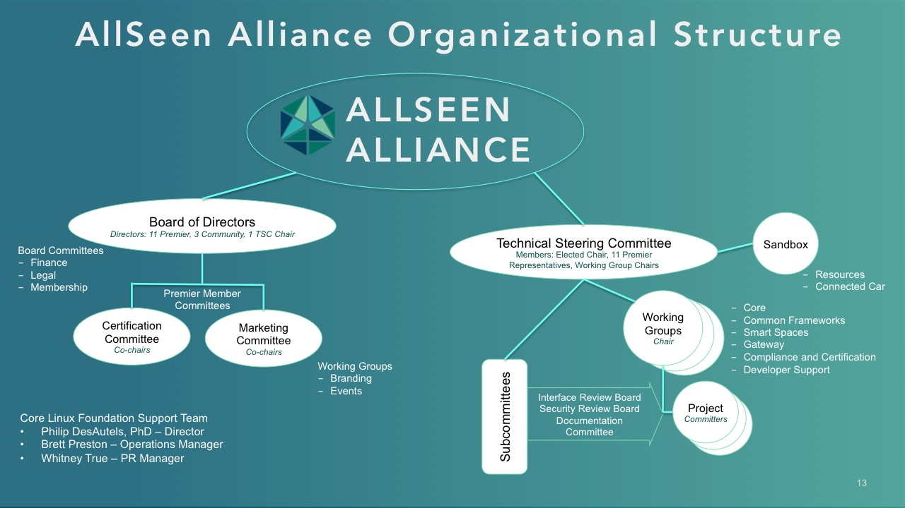

#### What is the AllSeen Alliance?

*  A nonprofit **consortium** dedicated to enabling the widespread adoption of billions of products, systems and serv  * ices that support the Internet of Things through an open environment, vibrant ecosystem and thriving technical community. 
 

*  A **community** enabling hardware manufacturers and software developers to create interoperable products that can discover, connect, communicate and interact directly with other devices, systems and services regardless of brand.

*  The host and developer of the collaborative AllJoyn **open source project**, an industry-supported software and service framework that makes a world full of smart connected products that work together possible. 

The AllSeen Alliance organization is open and inclusive. The structure is focused on delivering great open source software. Our [organizational bylaws](https///allseenalliance.org/about/governance) and [ TSC Charter](https///allseenalliance.org/about/governance/tsc/charter ) explain how we work. Find more details [about us here](https///allseenalliance.org/about).
 

*  Learn more here: [https://allseenalliance.org/about/get-involved](https///allseenalliance.org/about/get-involved)

*  Sign up for a mailing list: [https://lists.allseenalliance.org/mailman/listinfo](https///lists.allseenalliance.org/mailman/listinfo)

*  Get your technical questions answered: [http://stackoverflow.com/search?tab=newest&q=AllJoyn](http://stackoverflow.com/search?tab=newest&q=AllJoyn) 

*  Learn about AllJoyn: [https://allseenalliance.org/developers/learn](https///allseenalliance.org/developers/learn) 

*  Take some training: [https://wiki.allseenalliance.org/training](https///wiki.allseenalliance.org/training)

*  Start developing now: [https://wiki.allseenalliance.org/develop/overview](https///wiki.allseenalliance.org/develop/overview)
