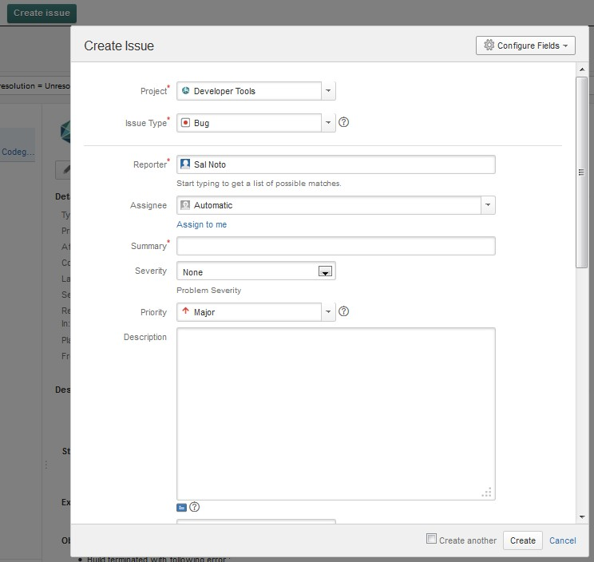
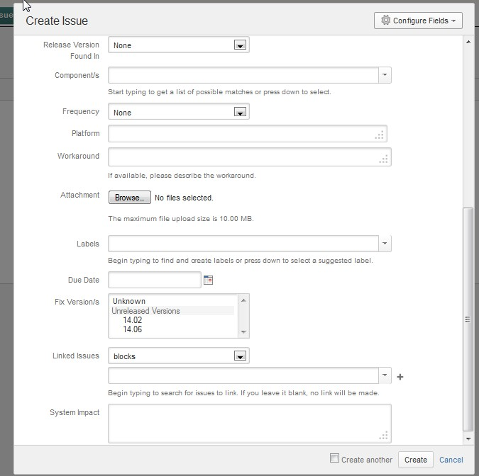

# Reporting Bugs

Thanks for taking the time to read this page.  The AllSeen Alliance has a [ Jira](https///jira.allseenalliance.org) instance to keep track of bugs and their fixes. This page will guide you through the steps to submit a bug.

## Getting an Account

Submission of a bug into our system requires that you have an account with the AllSeen Alliance.  If you don't already have one, please [Register Here](https///allseenalliance.org/user/register).

Note that you can view bugs without an Alliance account.

## Jira Projects

The following are the Jira projects that are currently available:

*  __Base Services__ - Use this project to submit bugs or new feature requests for the AllSeen Service Frameworks which includes Config, Control Panel, Notifications, Onboarding and Security.

*  __Core SW__ - Use this project to submit bugs or new feature requests for the AllSeen Core Software which includes  

*  __Developer Tools__ - Use this project to submit bugs or new feature requests for the Code Generator, and Python Wrapper

*  __Compliance and Certification__ - Use this project to submit bugs or new feature requests for Validation, Framework, Test Cases, and Test Runner.

## Submitting Issues

### General Principles

Critical feedback from community members is important to us, and is an integral part in enhancing and evolving the Alliance software.  We encourage the reporting of any and all issues.  There is no such thing as a bug that is too "small" or "unimportant" to document.  

Here are a few general rules to keep in mind when submitting tickets:

*  Submit one ticket for each discrete issue you are trying to report.

*  Provide objective problem descriptions and fact based information when submitting a ticket.

### Step By Step Instructions

In this example, we will use the Base Services Project.  Submitting tickets to other projects is very similar.

Step 1: After logging into Jira, select the Create Issue from the top banner of the Jira screen.

Step 2: The Create issue screen will be displayed as shown below:  

a) Select the **Project** that you are submitting the ticket against.  

b) Also, determine if you want to submit a Bug or a New Feature request and select the appropriate option from the **Issue Type Field**

*  A Bug is a product deficiency.  I expected X to happen, but instead Y happened.

*  A New Feature request is used to ask for new product functionality.  A new feature of the product, which has yet to be developed.

c) **Summary** - Please provide a very concise, one line summary of the issue.

d) **Severity** - Provide what you believe the severity is based on the following guidelines:  

*  __Blocking__:  Blocks development and/or testing work, production could not run. Example:  Device/Product crashes and does not recover.

*  __Critical__:  Bugs that cause a crash but are not easily reproducible or are in uncommon use cases (e.g. certain stress cases).  Negative user impact. No work-arounds available.  Examples:  Rare/infrequently occurring crash under system load and stress.

*  __Major:__  Bugs that have work-arounds, or cause incorrect behavior but not crashes. Example: Minor or less often used features broken.  Minor impact to the users

*  __Minor:__ Bugs that are cosmetic. Example:  Cosmetic problems like misspelled words and typos 

e) **Priority** -  Provide what you believe the priority is based on the following guidelines.  

*  P1 - Required to be fixed in this specific release

*  P2 - Required to be fixed in this specific release.

*  P3 - Should be fixed in this release family: i.e. in next point release

*  P4 - Should be fixed in next major/minor release.

*  P5 - Should eventually be fixed.

Note: The Severity and Priority values can be changed based on discussions and consensus at the triage meetings.

f) **Description** - 

*  High-level description of the issue which describes the specific problem.  

*  Why is it a bug?  Expected Outcome vs Actual Outcome

*  Description of the environment used and tools used to reproduce the issue.

*  Detailed steps to reproduce the issue.  Use numbered bullets, since this makes each step much easier to follow.

*  Specific versions/location of tested SW.
 

g) **Release Version Found In** - From the pull down menu, select the release version.

h) **Components** -  From the multi select pull down, choose the component(s) that exhibits the described behavior.

i) **Frequency**  -  How often does this problem happen?

j) **Platform**  - Describe the HW and OS used in this test.

k) **Workaround** - If applicable, when this issue occurs, what are the steps required to get back to normal operation.

l) **Attachment** - Attach log files and pertinent information that would help the developer root cause the issue. 

m) **Due Date/Fix Versions** - Will be assigned at the AllSeen triage meeting.

n) **System Impact** - If known, how does this issue impact how the system is designed to work.
## Receiving Email Notifications

Jira is configured to send out email notifications based on the following ticket state changes and roles:

{{ :develop:notifications.png?nolink |}}

** Additionally, email notifications will be sent to following mail lists:

*  Project Base Services -                   allseen-baseservices-tools@lists.allseenalliance.org

*  Project Core Software -                   allseen-core-tools@lists.allseenalliance.org

*  Project Developer Tools -                 allseen-devtools@lists.allseenalliance.org

*  Project Compliance and Certification -    allseen-cc-tools@lists.allseenalliance.org

You can add yourself to these and other mail lists[here](https///lists.allseenalliance.org/mailman/listinfo).

## Ticket Triage Process

## Contact Us

Do you still have questions about submitting a bug that has not been answered?  Please feel free to email us @ allseen-infrastructure@lists.allseenalliance.org

